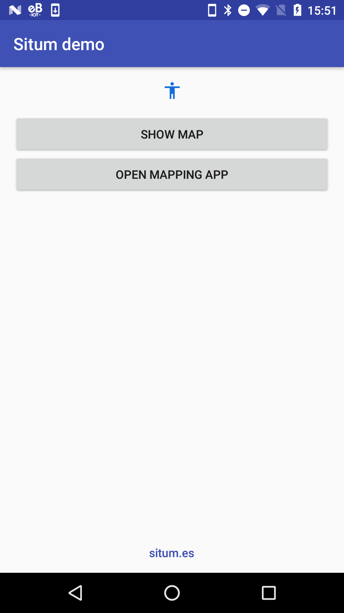
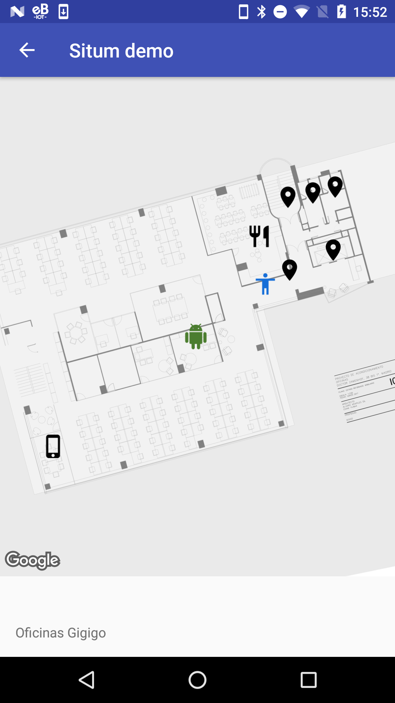
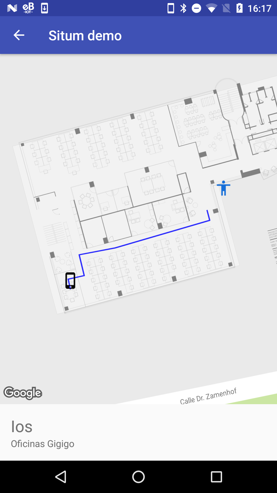

# Situm demo
This is a simple app to test situm sdk.

## Usage
1. **Config your api key and your user in keys.properties file**
2. **Set your building id in MapsActivity.kt.**

## Situm doc
* [situm.es/developers](https://situm.es/en/developers)
* [Javadoc](http://developers.situm.es/sdk_documentation/android/javadoc/2.5.0/)